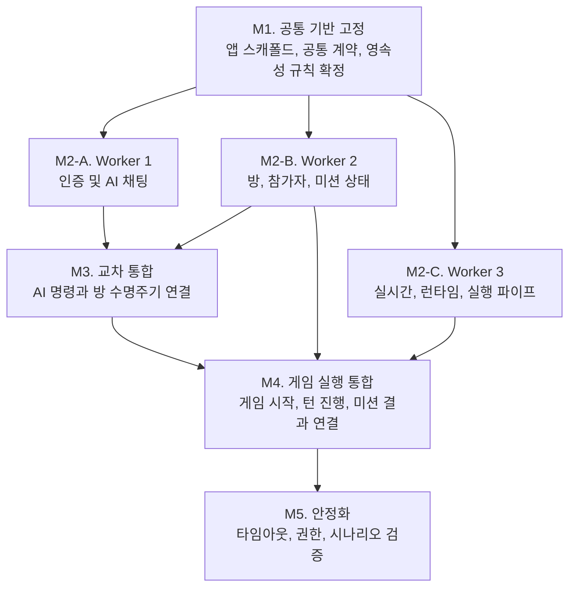
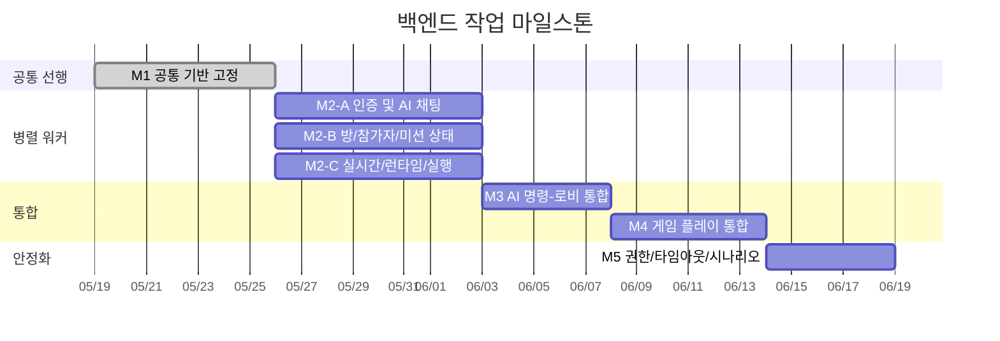

# Backend 마일스톤

## 목적

이 문서는 `docs/plans` 하위 계획서를 기준으로 백엔드 작업을 기술 리더 관점에서 빠르게 판단할 수 있도록 마일스톤 단위로 재구성한 요약본이다.

- 기준 문서:
  - `docs/plans/common-sequential-plan.md`
  - `docs/plans/worker-1-auth-and-ai-chat-plan.md`
  - `docs/plans/worker-2-room-participant-mission-plan.md`
  - `docs/plans/worker-3-realtime-runtime-execution-plan.md`
- 핵심 원칙:
  - 공유 계약과 인프라를 먼저 고정한다.
  - 이후 3개 워커를 병렬로 진행한다.
  - 병렬 작업 완료 후 공유 통합 트랙에서 게임 흐름을 연결한다.
  - 마지막에 권한, 타임아웃, 시나리오 검증으로 마감한다.

## 전체 로드맵

## 마일스톤 요약

| 마일스톤 | 목표 | 포함 범위 | 선행 조건 | 완료 기준 |
|---|---|---|---|---|
| M1 | 병렬 작업이 가능한 공통 기반 확정 | C1, C2 | 없음 | 스캐폴드, 공통 응답/에러 계약, enum, 마이그레이션 전략이 고정됨 |
| M2-A | 인증 및 AI 채팅 흐름 완성 | W1-1 ~ W1-4 | M1 | 인증 API, AI 채팅 조회/저장, 의도 파싱, 후속 메시지 생성이 독립 검증 가능 |
| M2-B | 방/참가자/미션 도메인 완성 | W2-1 ~ W2-4 | M1 | 방 생성 기반, 참가자 상태, 게임 시작 준비, 힌트 및 미션 상태 전이가 독립 검증 가능 |
| M2-C | 실시간/런타임 지원 계층 완성 | W3-1 ~ W3-4 | M1 | WebSocket 입장, 코드 동기화, 실행 기록, 턴 이벤트 훅이 독립 검증 가능 |
| M3 | AI 명령과 로비 수명주기 통합 | C3 | M2-A, M2-B | AI 명령이 서버 검증 경로를 통해 방 생성, 초대, 참여, 거절, 게임 시작 준비로 연결됨 |
| M4 | 게임 플레이 본 흐름 통합 | C4 | M3, M2-B, M2-C | 게임 시작, 턴 제출/타임아웃, 실행/평가, 미션 완료 브로드캐스트가 하나의 파이프라인으로 연결됨 |
| M5 | 운영 관점 안정화 | C5 | M4 | 권한, 타임아웃, 중복 제출, 재연결 정책, 핵심 시나리오 검증이 마무리됨 |

## 마일스톤 상세

### M1. 공통 기반 고정

목적은 이후 워커들이 각자 계약을 재정의하지 않도록 기반을 먼저 얼리는 것이다.

- 포함 작업:
  - 앱 및 인프라 스캐폴드 구축
  - 공통 응답 포맷, 에러 포맷, request ID 규칙 확정
  - 공통 enum, ORM, 마이그레이션, 시드 전략 확정
  - JWT, PostgreSQL, Redis, LLM 환경 로딩 기준 수립
- 리더 체크포인트:
  - 워커 간 계약 충돌 여지가 남아 있지 않은가
  - DTO, enum, 이벤트 명명 규칙이 문서 기준으로 확정됐는가
  - 이후 병렬 작업이 동일한 저장소 구조를 전제로 진행 가능한가

### M2-A. Worker 1 인증 및 AI 채팅

목적은 사용자 진입과 AI 기반 명령 해석을 독립 모듈로 완성하는 것이다.

- 포함 작업:
  - 회원가입, 로그인, 닉네임 중복 확인, 리프레시 토큰 회전
  - AI 채팅 세션/메시지 조회 및 저장
  - LLM 기반 의도 파싱과 내부 명령 DTO 매핑
  - 방 생성/초대/참여/거절/시작 준비용 AI 후속 메시지
- 리더 관점 산출물:
  - 인증 API가 안정적으로 닫힘
  - AI는 보조 역할만 수행하고 상태 권한은 갖지 않음
  - 공유 통합 단계에서 사용할 명령 DTO가 준비됨

### M2-B. Worker 2 방, 참가자, 미션 상태

목적은 서버 권위(authoritative)를 가지는 핵심 게임 도메인을 먼저 안정화하는 것이다.

- 포함 작업:
  - 방 및 참가자 영속 모델, 상태 전이, 권한 검증
  - 메인 진입용 방/참가자 조회 API
  - 미션 템플릿, 방 미션, 게임 시작 준비 로직
  - 현재 스텝 힌트 조회와 미션 완료 전이 도우미
- 리더 관점 산출물:
  - 방과 멤버십 규칙이 서비스 계층에서 일관되게 강제됨
  - 게임 시작 전후 상태 모델이 고정됨
  - 이후 AI/실시간 계층이 올라타도 도메인 책임이 흔들리지 않음

### M2-C. Worker 3 실시간, 런타임, 실행 파이프

목적은 비권위 계층인 전송, 실행, 실시간 보조 흐름을 병렬로 완성하는 것이다.

- 포함 작업:
  - 인증 기반 WebSocket 입장과 룸 세션 관리
  - 코드 변경 동기화와 ephemeral 상태 저장
  - 런타임 어댑터와 실행 결과 영속화
  - 턴 제출, 평가, 상태 갱신, 미션 결과 이벤트 훅
- 리더 관점 산출물:
  - 게이트웨이는 오케스트레이션만 담당하고 상태 결정은 하지 않음
  - 코드 동기화는 영속 저장이 아니라 지원 상태로 제한됨
  - 게임 턴 통합 시 필요한 이벤트/실행 기반이 준비됨

### M3. AI 명령과 로비 수명주기 통합

목적은 Worker 1의 AI 명령 해석 결과를 Worker 2의 도메인 서비스에 연결하는 것이다.

- 포함 작업:
  - `ROOM_CREATE`, `USER_INVITE`, `ROOM_JOIN`, `USER_INVITE_DENY`, `GAME_START` 연결
  - AI 파싱 결과를 내부 검증 DTO로 변환 후 서비스 호출
  - 잘못된 AI 결과가 상태를 바꾸지 못하도록 차단
- 리더 체크포인트:
  - AI는 입력 해석만 하고 최종 상태 결정은 서버가 하는가
  - 초대/수락/거절/시작 준비가 모두 동일한 검증 경로를 타는가

### M4. 게임 플레이 본 흐름 통합

목적은 로비 단계를 넘어 실제 게임 진행을 하나의 서버 파이프라인으로 묶는 것이다.

- 포함 작업:
  - 게임 시작 시 미션, 스텝, 첫 턴, 초기 브로드캐스트 생성
  - 턴 제출 및 타임아웃 시 스냅샷, 실행, 평가, 다음 턴 생성 연결
  - 최종 미션 완료 및 결과 이벤트 브로드캐스트
- 리더 체크포인트:
  - 턴 흐름이 실시간 계층과 영속 계층 사이에서 끊기지 않는가
  - 실행 실패와 미션 실패가 명시적으로 구분되는가
  - 이벤트 이름과 페이로드가 API 명세와 일치하는가

### M5. 안정화

목적은 MVP 운영 리스크를 줄이는 마지막 검증 단계다.

- 포함 작업:
  - 타임아웃 처리와 수동 제출 경로 정합성 확인
  - 중복 제출, 방 권한, 턴 권한, 재연결 정책 검증
  - 핵심 사용자 시나리오와 실패 시나리오 점검
- 리더 체크포인트:
  - 보안/권한 규칙이 빠진 구간이 없는가
  - 재연결 및 이탈 상태 정책이 명세와 일치하는가
  - MVP 기준의 E2E 흐름이 문서 기준으로 설명 가능한가

## 병렬화 전략

위 간트는 상대 순서를 보여주기 위한 예시이며, 실제 일정 확정본은 아니다. 다만 다음 구조는 고정으로 보는 것이 안전하다.

- 반드시 순차:
  - M1 → M2 병렬 시작
  - M3 → M4 → M5
- 병렬 가능:
  - M2-A, M2-B, M2-C
- 핵심 크리티컬 패스:
  - M1 → M2-B → M3 → M4 → M5
  - 이유: Worker 2의 도메인 상태 모델이 통합 단계 대부분의 선행 조건이기 때문

## 리스크 요약

| 리스크 | 영향 | 대응 방향 |
|---|---|---|
| 공통 enum, DTO, 이벤트 계약이 병렬 작업 중 변경됨 | 높음 | M1에서 계약을 고정하고 이후 변경은 공유 트랙에서만 처리 |
| AI 계층이 서버 권한을 침범함 | 높음 | M3에서 모든 상태 변경을 도메인 서비스 검증 경로로만 연결 |
| 실시간 이벤트와 영속 상태가 분리되어 흐름 불일치 발생 | 높음 | M4에서 스냅샷, 실행, 평가, 브로드캐스트를 하나의 흐름으로 검증 |
| 타임아웃, 재연결, 중복 제출 같은 운영 예외가 후반에 누락됨 | 중간 | M5에서 운영 리스크 중심으로 별도 안정화 검증 수행 |

## 권장 리뷰 순서

기술 리더가 빠르게 판단하려면 아래 순서로 보면 된다.

1. M1에서 고정해야 하는 계약이 충분히 식별됐는지 확인
2. M2-B가 실제 authoritative domain으로 설계됐는지 확인
3. M2-A와 M2-C가 도메인 권한을 침범하지 않는지 확인
4. M3, M4에서 통합 포인트와 책임 경계가 명확한지 확인
5. M5에서 운영 예외 검증이 MVP 수준으로 충분한지 확인
